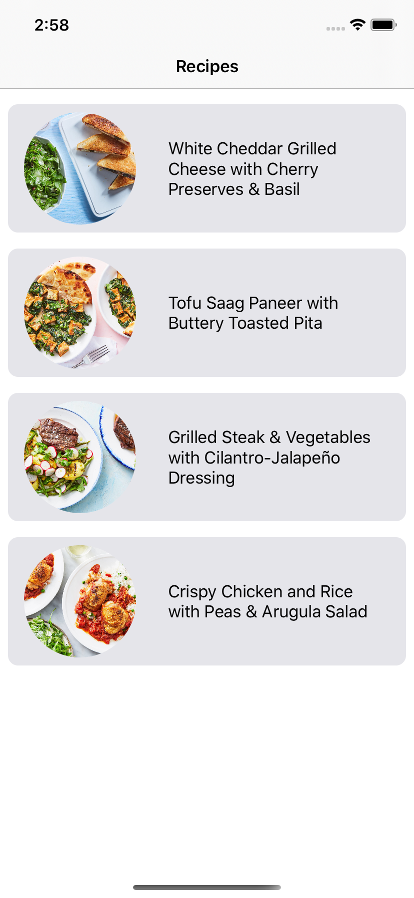

# Recipes : Mobile assignment (iOS)

Following subjects used in this project:
* Xcode 11.5
* iOS 10+
* VIPER architecture
* Apollo :     GraphQL client
* RxSwift :     Reactive Programming
* SnapKit : Better constraints functionality
* Kingfisher : URL image loading

## Prerequisite
### Please replace 'ACCESS_TOKEN', 'ENVIRONMENT_ID' and 'SPACE_ID' values with the given information in the description.
### These values are in the build setting tab, and in the User-Defined section (MS_ACCESS_TOKEN, MS_ENVIRONMENT_ID, MS_SPACE_ID).

## Technical declaration:
* The project is based on VIPER arch, and integrated with RxSwift to reduce boilerplate code (like extra protocols and delegation patterns between VIPER layers).
* RepositoryGraphQL: To call service(s), Apollo and graphql is used. graphQL files (schema.json and auto-generated code) is generated by cli. So I didn't put any build scripts.
* RepositoryREST: As an alternative way to support REST APIs, there is a contentful client implementation, that can be replaced by graphQL to show flexibility and expandalility (this feature is functional but needs improvement and R&D. tag and chef fields are not responding in this version).
* SPM will prepare all third-party libraries. No need for Cocoapods or Carthage.
* Unit and UI tests is covering important part of the project.

| Main Page  | Detail Page |
|------------|-------------|
|  |  |
